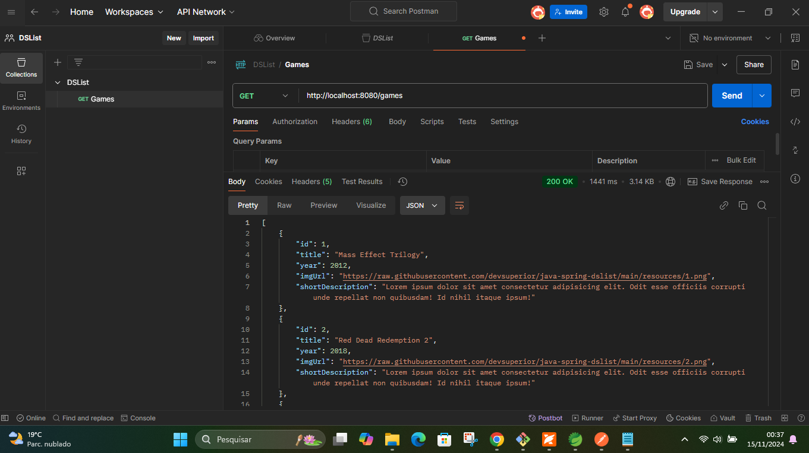

## Uma API Restefull com Java e Spring, Maven, ORM, DTO

• Conceitos

• Sistemas web e recursos

• Cliente/servidor, HTTP, JSON

• Padrão Rest para API web

• Estruturação de projeto Spring Rest

• Entidades e ORM

• Database seeding

• Padrão camadas

• Controller, service, repository

• Padrão DTO

